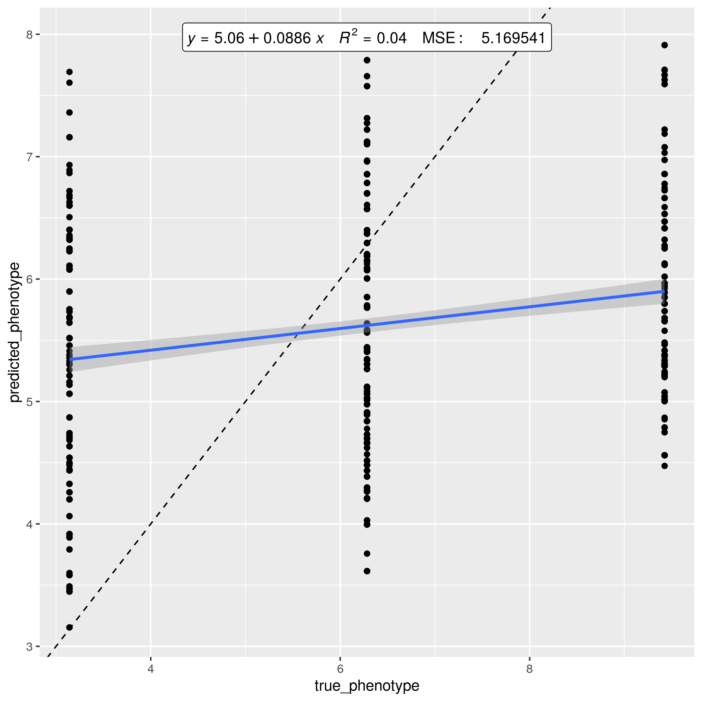
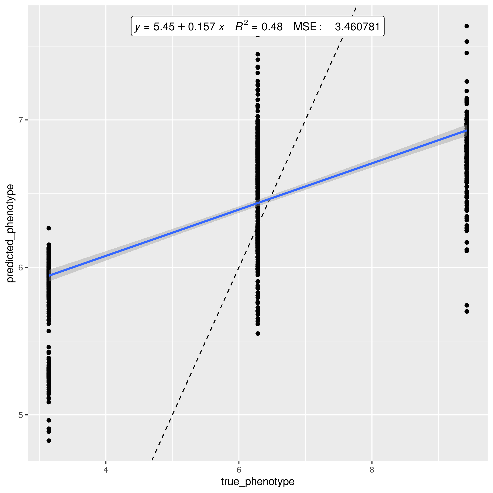
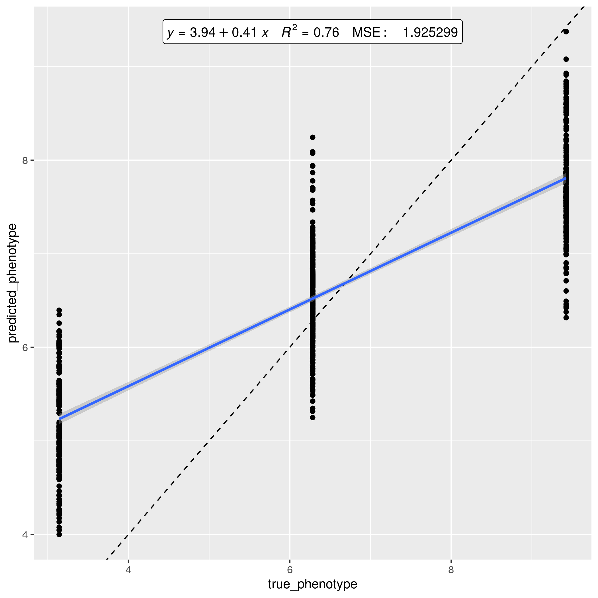
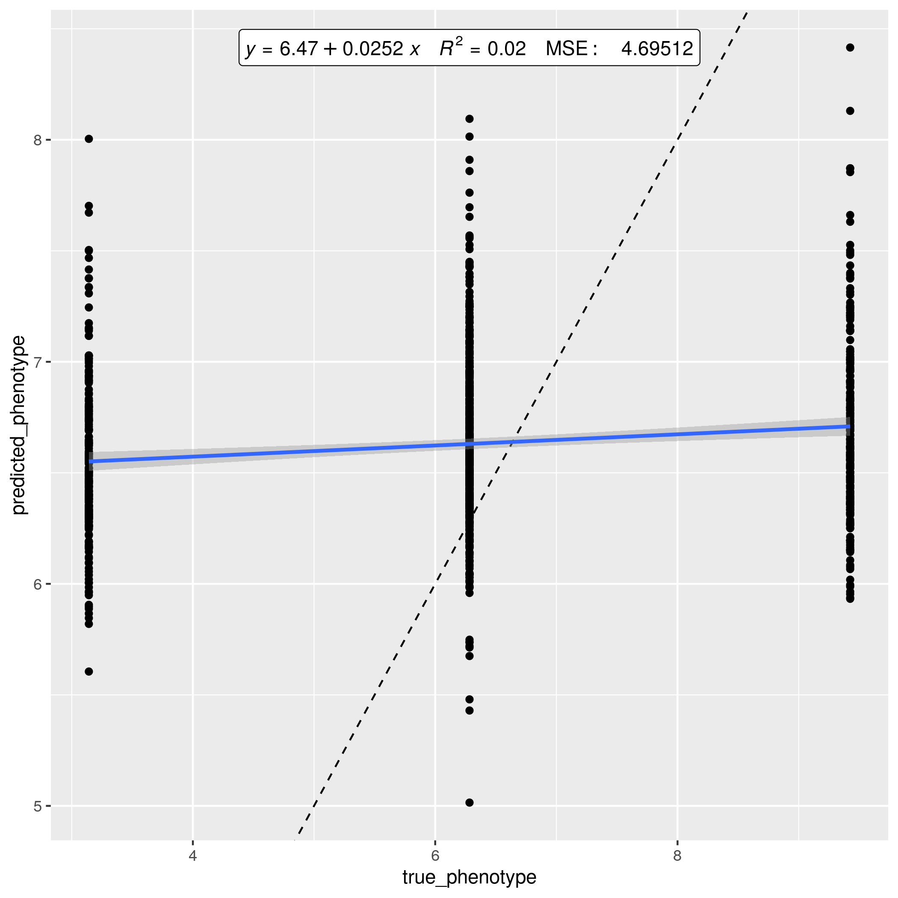
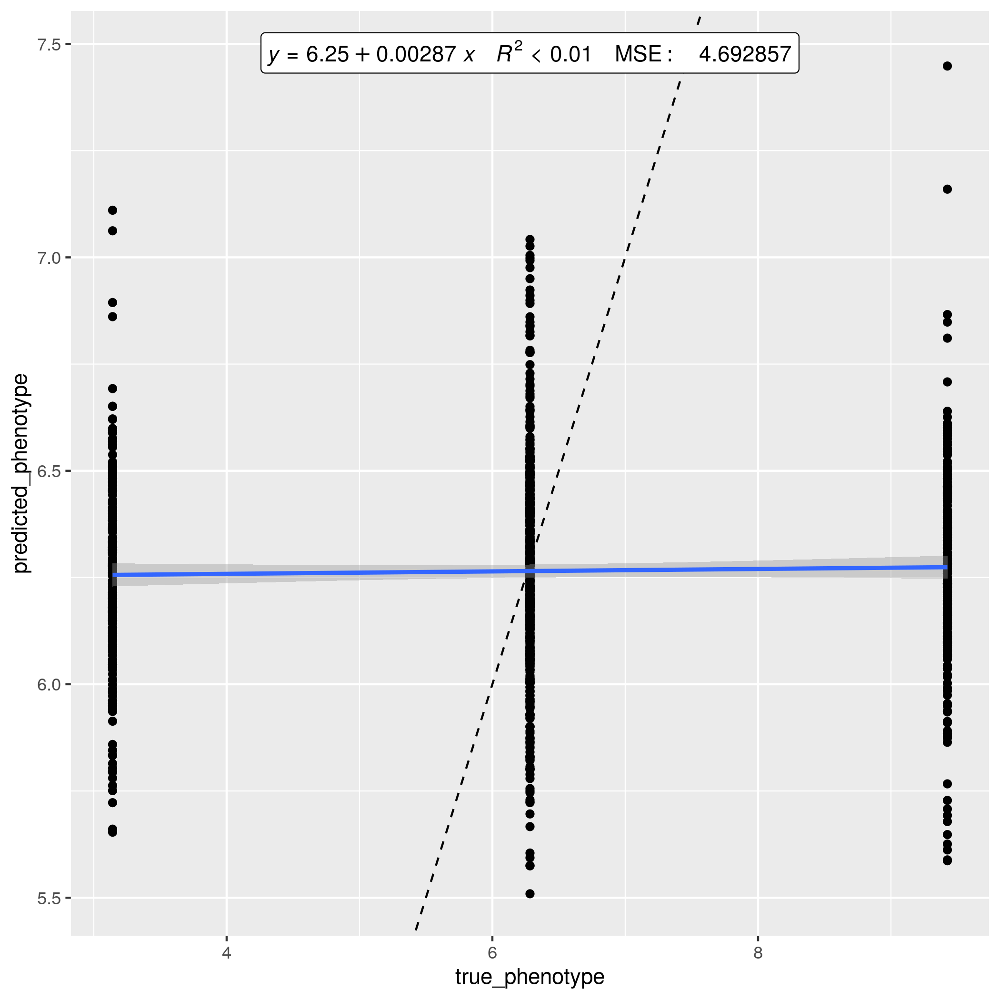
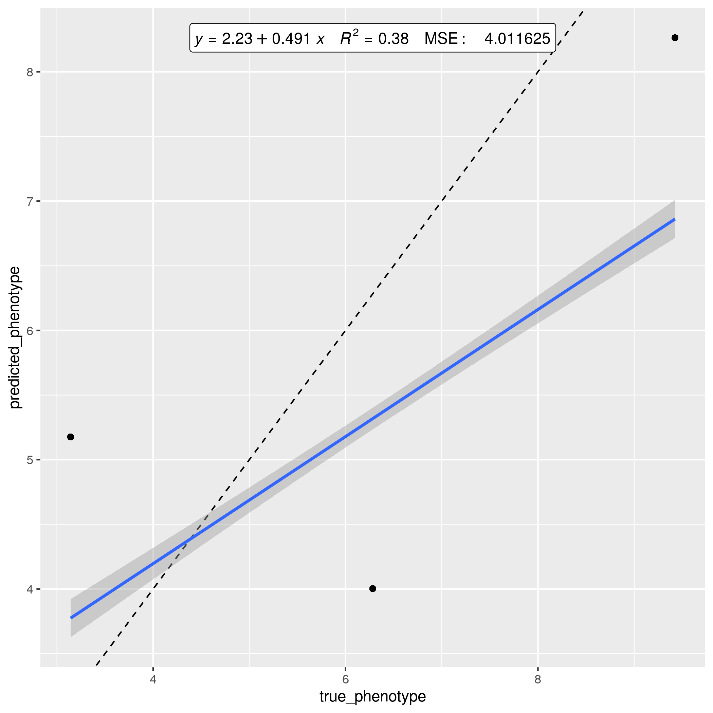
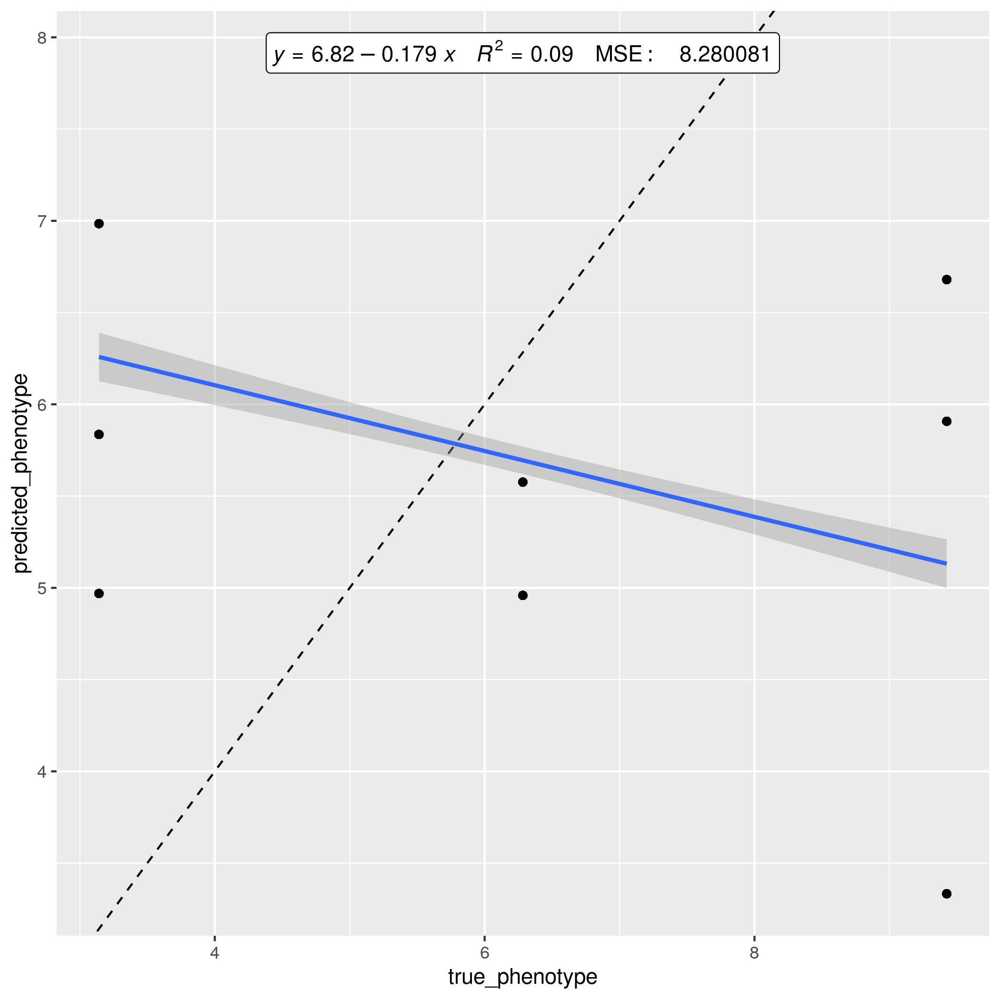
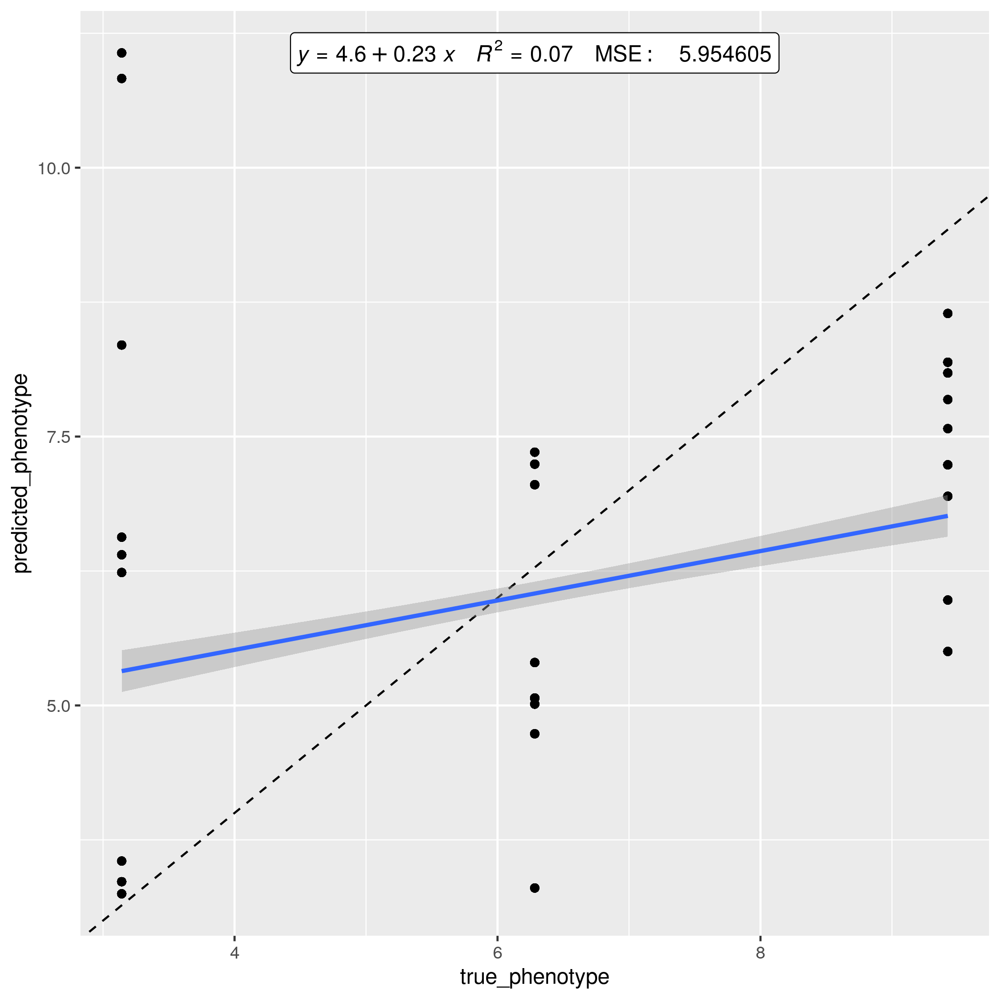
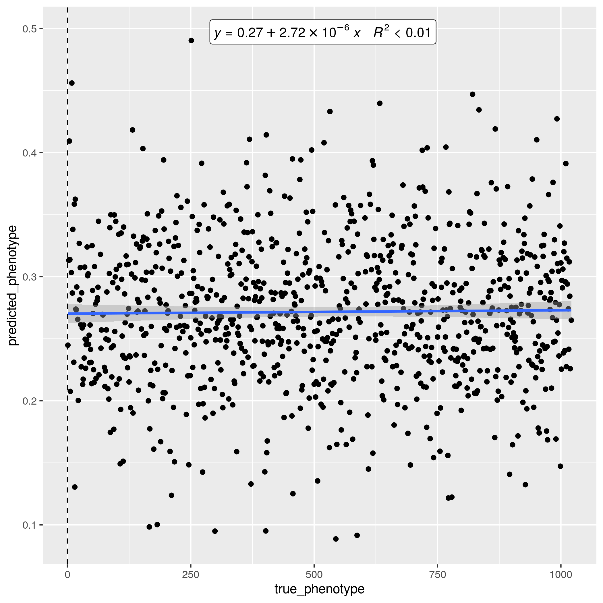

# science_presentation_20220305

Presentation of my scientific work at 2022-03-05

## Goal

Accurate quantitative trait prediction

## Results

### An example 

[show fam, bed, bim]

### 1 SNP contributing to 1 trait

Here is a reasonable prediction, would it be real data:

PLINK will find the SNP that has an effect.

### 1 SNP contributing to 1 trait, 1000 SNPs having no effect

Adding 1000 SNPs that do nothing, however, kills GCAE:

PLINK will find the SNP that has an effect.

### 1000 SNPs contributing to 1 trait

Adding 999 SNPs that are additive as well, also, kills GCAE:

Note that PLINK will also fail to detect each SNP having an effect.

### Gradient

### Model p0

> 0 noise, p0

> 1 noise, p0

> 2 noise, p0

> 3 noise, p0

> 4 noise, p0

> 5 noise, p0

> 6 noise, p0

> 7 noise, p0

> 8 noise, p0

> 9 noise, p0

> 10 noise, p0

### Model p1

> 0 noise, p1

> 1 noise, p1

> 2 noise, p1

> 3 noise, p1

> 4 noise, p1

> 5 noise, p1

> 6 noise, p1

> 7 noise, p1

> 8 noise, p1

> 9 noise, p1

> 10 noise, p1

### Model p2

> 0 noise, p2

> 1 noise, p2

> 2 noise, p2

> 3 noise, p2

> 4 noise, p2

> 5 noise, p2

> 6 noise, p2

> 7 noise, p2

> 8 noise, p2

> 9 noise, p2

> 10 noise, p2

### Real data

> NSPHS, 1k SNPs

> NSPHS, 10k SNPs

